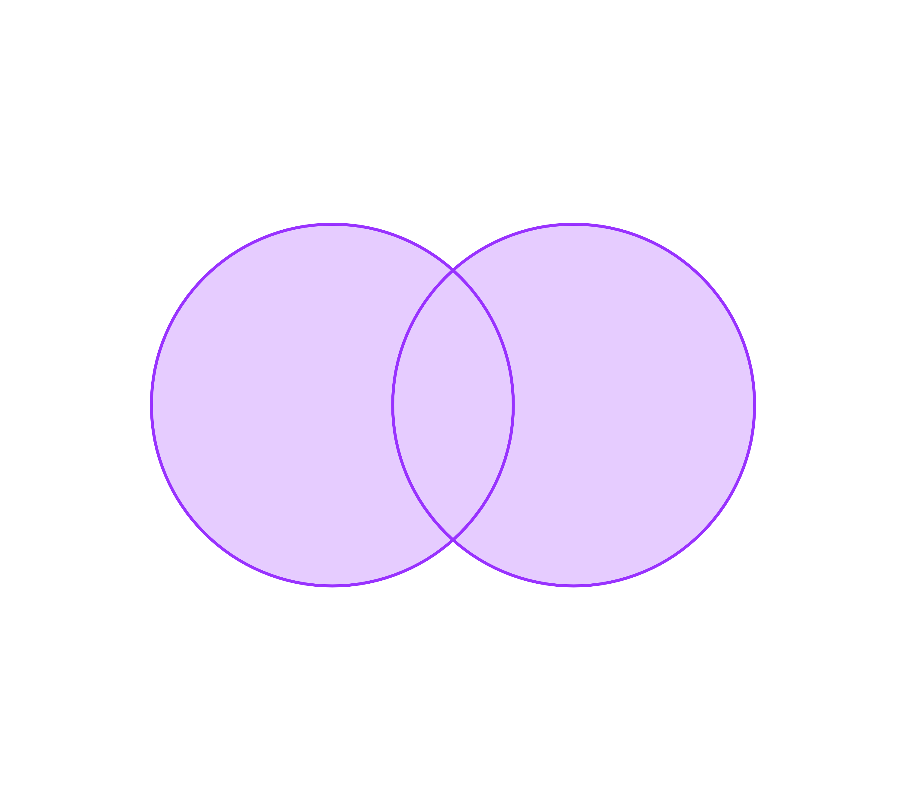

# Množiny

Množina je soubor takových objektů, že o každém objektu můžeme rozhodnout, zda do množiny patří nebo nepatří.

Můžeme ji zadat **výčtem prvků**, například $A=\{1; 4;8;18;20\}$ nebo pomocí **charakteristické vlastnosti**, například $B=\{x | x \space je \space jednociferné \space kladné \space sudé \space číslo\}$. Ne vždy je možné zapsat množinu pomocí charakteristické vlastnosti.

Množinu nemusí tvořit pouze čísla.

## Vztahy prvků a množin

Symbol $\in$ značí, že prvek do množiny **náleží**:

$$
8 \in A \space| \space A=\{1; 4;8;18;20\}
$$

Symbol $\notin$ znáčí, že prvek do množiny **nenáleží**.

$$
3 \notin A \space| \space A=\{1; 4;8;18;20\}
$$

Pokud množina nemá žádný prvek jedná se o tzv. **prázdnou množinu** a výčet prvků se označuje: $\emptyset$

## Grafické znázornění

Množiny a jejich vztahy lze zadat graficky pomocí **Vennových diagramů**.

## Vztahy množin

- Rovnost $(=)$ - množiny jsou si rovny právě tehdy, pokud obsahují stejný počet stejných prvků.

$$
B = D\space|\space B = \{x\in N|0<2x<10\}, \space D = \{2;4;6;8\}
$$

- Inkluze $(\subseteq)$ \[:být podmnožinou:\] - množina S je podmnožinou T, pokud každý prvek množiny S je zároveň prvek množiny T a množiny se **mohou rovnat**.

$$
B \subseteq D\space|\space B = \{x\in N|0<2x<10\}, \space D = \{2;4;6;8\}
$$

- Ostrá inkluze $(\subset)$ \[:být vlastní podmnožinou:\] - množina S je vlastní podmnožinou T, pokud každý prvek množiny S je zároveň prvek množiny T a množiny se **nerovnají**.

$$
C\subset A \space | \space C = \{1;4\}, \space A=\{1; 4;8;18;20\}
$$

## Operace s množinami

- Průnik $(\cap)$ - průnikem množiny S a T jsou všechny prvky, které současně patří do každé z nich

$$
A \cap D \space = \{4; 8\} | \space A=\{1; 4;8;18;20\},\space D = \{2;4;6;8\}
$$

- Sjednocení $(\cup)$ - sjednocením množin S a T jsou všechny prvky, které patří alespoň do jedné z nich.

$$
C \cup D \space = \{1;2;4;6;8\} | \space C=\{1; 4\},\space D = \{2;4;6;8\}
$$

- Rozdíl $(-;/)$\- rozdílem množin S a T jsou všechny prvk, které patří do S, ale zároveň nepatří do T

$$
A - D= \{1; 18;20\}, \space D \backslash A=\{2;6\} | \space A=\{1; 4;8;18;20\},\space D = \{2;4;6;8\}
$$

- Doplněk $(S_{\mathbb{R}}^{’})$ - doplňkem množiny S je množina všech prvků, které nepatří do S, ale patří do jiné předem známé množiny

$$
S_{\mathbb{R}}^{’} = (-\infty;5\rangle \cup (8;\infty) \space | S = (5;8\rangle
$$

## Číselné obory

Mezi nejčastější množiny patří číselné obory:

- Obor přirozených čísel $(\mathbb{N})$ - Zahrnuje veškerá čísla, díky kterým lze označit počet prvků v konečné množině. Jedná se tedy o kladné nedesetinné čísla: $1; 2; 3...$
- Obor celých čísel $(\mathbb{Z})$ - Zahrnuje veškerá přirozená čísla, čísla k nim opačná a nulu. $-5; 0; 5; 1000$
- Obor racionálních čísel $(\mathbb{Q})$ - Zahrneje veškerá čísla, která lze zapsat ve tvaru zlomku $\frac{p}{q}$, kde $p$ je celé číslo a $q$ je číslo přirozené. $-4; -0,25; \frac{1}{2}; 100$, a periodická čísla $0,\bar{3}$
- Obor reálných čísel $(\mathbb{R})$ - Zahrnuje veškerá čísla, která vyjadřují délky úseček, čísla k nim opačná a nula. Patří sem tedy i čísla iracionální: $\pi;-5;-0.5;\sqrt{2}$

Podmnožiny reálných čísel zapisujeme intervaly. Druhy intervalů:

- otevřený interval - $(a;b)$, čteme jako :"otevřený interval od $a$ do $b$" - samotné $a$ ani $b$ do množiny nepatří
- uzavřený interval - $\left\langle a;b \right\rangle $, čteme jako: "uzavřený interval od $a$ do $b$" - samotné $a$ i $b$ do množiny poatří
- poloouzavřený interval - $(a;b \right\rangle $, čteme jako: "polouzavřený interval z prava uzavřenný od $a$ do $b$" - samotné $a$ do množiny nepatří, ale samotné $b$ do množiny patří

Pokud začínají nebo končí hodnoty intervalu v nekonečnu - $(-\infty ;a)$ - tak u nekonečna musí být otevřený interval.

- Obor komplexních čísel $(\mathbb{C})$ - Jedná se o nadstavbu reálných čísel ve které lze odmocňovat záporná čísla. Místo grafického vyjádření reálných čísel přímkou jsou komplexní čísla vyjádřena rovinou.

Všechny tyto obory mají nekonečně mnoho prvků.

# Výroková logika

Výrok je každé tvrzení, u kterého můžeme rozhodnout jeho pravdivost - jestli je pravdivé nebo nepravdivé. Může být zadán slovně: "Venku prší." nebo matematickým zápisem: $x^2+1>0$.

**Pravdivostní hodnota** výroku je informace o tom zda pravdivý je (pravdivostní hodnota = 1) nebo není (pravdivostní hodnota = 0).

Často se ve výrokové logice setkáváme s kvantifikátory, které určují relaticní množství prvků, pro které platí.

- **Obecný kvantifikátor** - $\forall$ - znamená: "pro každý prvek platí..., pro žádné $x$ neplatí..."
- **Existenční kvantifikátor** - $\exists$ - znamená: "existuje alespoň jeden prvek, pro který platí..."

## Vztahy výroků

### Negace

Negace výroku $a$ značíme $\neg a$. Ve slovním vyjádření se čte jako: "není pravda, že $a$" (Příklad: $\neg a=$ "Není pravda, že venku prší.")

V matematice se často setkáváme s těmito negacemi:

- $a=$"Množina A má alespoň $n$ prvků" $\longrightarrow$ $\neg a=$"Množina A má nejvýše $n-1$ prvků."
- $a=$"Množina A má nejvýše $n$ prvků" $\longrightarrow$ $\neg a=$"Množna A má alespoň $n+1$ prvků."
 - $a=$"Pro právě jeden člen množiny $A$ platí $x$" $\longrightarrow$ $\neg a=$"Pro žádný prvek množiny $A$ neplatí $x$ a nebo platí pro alespoň dva prvky."

Negace kvantifikátorů:

- Obecný kvantifikátor $\longrightarrow$ existenční kvantifikátor - $a=\forall x;\space x>5$ $\longrightarrow$ $\neg a=\exists x;\space x<5$
- Existenční kvantifikátor $\longrightarrow$ obecný kvantifikátor - $a=\exists x;\space x-5=1$ $\longrightarrow$ $\neg a=\forall x;\space x-5\neq 1$

### Složené výroky

Složené výroky jsou soubory výroků, mezi kterými je vždy nějaký poměr. Složené výroky se také nemusí skládat z jednoduchých výroků, ale i z jinýčh složených výroků. Potom je pravdivostní hodnota vstupního složeného výroku určena podle vlastních vstupních výroků. Viz. pravdivostní tabulka.

#### Konjunkce

Konjunkci výroků $a$ a $b$ značíme $a\wedge b$ a čteme: "výrok $a$ a (zároveň) výrok $b$". Konjunkce je pravdivá jen tehdy, jsou-li oba dílčí výroky pravdivé.

#### Disjunkce 

Disjunkci výroků $a$ a $b$ značíme $a\vee b$ a čteme: "výrok $a$ nebo výrok $b$". Disjunkce je pravdivá jen tehdy, je-li alespoň jeden z dílčích výroků pravdivý.

#### Implikace 

Implikaci výroků $a$ a $b$ značíme $a\implies b$ a čteme: "výrok $a$ implikuje $b$" nebo taky: "Jesliže výrok $a$, pak výrok $b$". Implikace je pravdivá vždy s výjimkou situace, kdy $a$ je pravdivé, ale $b$ je nepravdivé - protože z pravdy nemůže plynout nepravda.

- Například: $a=$"prší" a $b=$"nosím deštník", takže $a\implies b=$ "Jesliže prší, pak nosím deštník."

##### Vlastnosti implikace

- **Obrácená implikace** k implikace $a\implies b$ je implikace $b\implies a$. Nemusí mít stejnou pravdivostní hodnotu jako původní implikace. Například: $b\implies a=$"Jesliže nosím deštník, pak prší."
- **Obměněná implikace** k implikaci $a\implies b$ je implikace $\neg b\implies\neg a$. Má vždy stejnou pravdovostní hodnotu jako původní impliace. Například: $\neg b\implies \neg a=$"Jestliže nenosím deštník, pak neprší."
- **Negací implikace** $a\implies b$ je $a\wedge\neg b$. Například: $a\wedge\neg b=$"Prší a nenosím deštník."

#### Ekvivalence

Ekvivalence výroků $a$ a $b$ značíme $a\iff b$ a čteme: "Výrok $a$ právě tehdy, když výrok $b$." Ekvivalence je pravdivá tehdy, jsou li oba dílčí výroky pravdivé nebo oba nepravdivé.

### Tabulka pravdivosti

Tabulka pravdivosti nám ukazuje, kdy jsou dané složené výroky pravdivé v závislosti na pravdivosti jednotlivých vstupních výroků. V tabulce se značí známými značkami - $0$ je nepravdivý výrok a $1$ je pravdivý výrok.

| $a$ | $b$ | $\neg a$ | $a\wedge b$ | $a\vee b$ | $a\implies b$ | $a\iff b$ | $\neg a\vee b$ | $(\neg a\vee b)\iff (a\implies b)$|
| ------- | ------- | ------- | ------- | ------- | ------- | ------- | ------- | ------- |
| $1$ | $1$ | $0$ | $1$ | $1$ | $1$ | $1$ | $1$ | $1$ |
| $1$ | $0$ | $0$ | $0$ | $1$ | $0$ | $0$ | $0$ | $1$ |
| $0$ | $1$ | $1$ | $0$ | $1$ | $1$ | $1$ | $1$ | $1$ |
| $0$ | $0$ | $1$ | $0$ | $0$ | $0$ | $1$ | $1$ | $1$ |

Speciálním případem výroku je **Tautologie**. Jedná se o takový výrok, který je vždy pravdivý. Příkladem tautologie je třeba složen výrok $(\neg a\vee b)\iff (a\implies b)$, což si můžeme ověřit v posledním sloupci tabulky.

